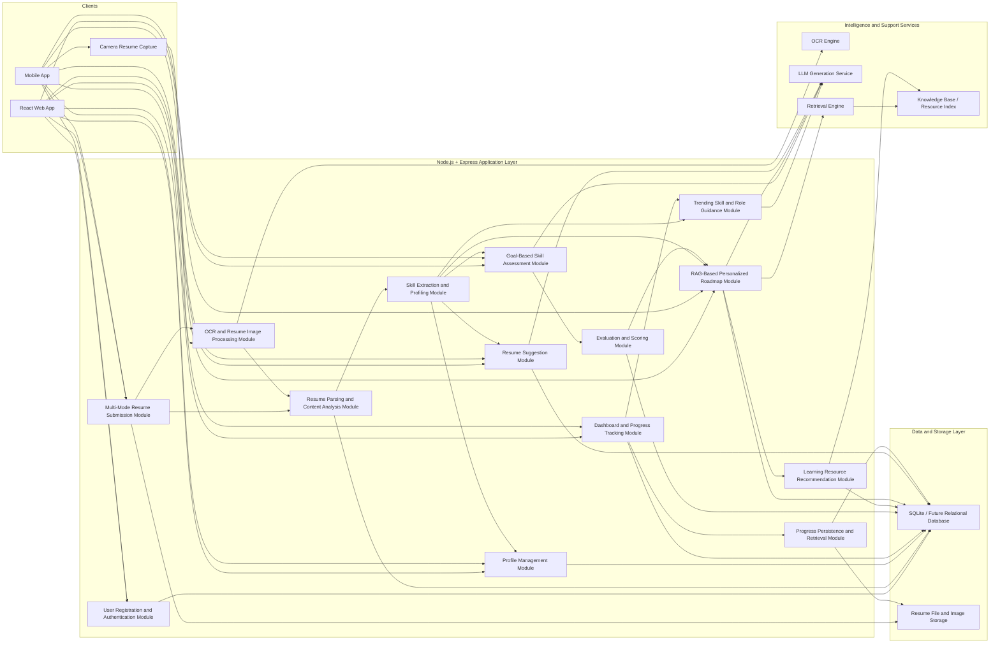

# SkillBridge Full Module Architecture Diagram

```mermaid
flowchart LR
    subgraph Clients
        WEB[React Web App]
        MOBILE[Mobile App]
        CAMERA[Camera Resume Capture]
    end

    subgraph API["Node.js + Express Application Layer"]
        AUTH[User Registration and Authentication Module]
        SUBMIT[Multi-Mode Resume Submission Module]
        OCRMOD[OCR and Resume Image Processing Module]
        PARSER[Resume Parsing and Content Analysis Module]
        SKILL[Skill Extraction and Profiling Module]
        PROFILE[Profile Management Module]
        DASH[Dashboard and Progress Tracking Module]
        TREND[Trending Skill and Role Guidance Module]
        EXAM[Goal-Based Skill Assessment Module]
        SCORE[Evaluation and Scoring Module]
        ROADMAP[RAG-Based Personalized Roadmap Module]
        RESOURCE[Learning Resource Recommendation Module]
        SUGGEST[Resume Suggestion Module]
        PERSIST[Progress Persistence and Retrieval Module]
    end

    subgraph Intelligence["Intelligence and Support Services"]
        OCR[OCR Engine]
        LLM[LLM Generation Service]
        RETRIEVE[Retrieval Engine]
        KB[Knowledge Base / Resource Index]
    end

    subgraph Data["Data and Storage Layer"]
        DB[SQLite / Future Relational Database]
        FILES[Resume File and Image Storage]
    end

    WEB --> AUTH
    WEB --> SUBMIT
    WEB --> PROFILE
    WEB --> DASH
    WEB --> EXAM
    WEB --> ROADMAP
    WEB --> SUGGEST

    MOBILE --> AUTH
    MOBILE --> SUBMIT
    MOBILE --> PROFILE
    MOBILE --> DASH
    MOBILE --> EXAM
    MOBILE --> ROADMAP
    MOBILE --> SUGGEST
    MOBILE --> CAMERA
    CAMERA --> OCRMOD

    AUTH --> DB
    SUBMIT --> FILES
    SUBMIT --> OCRMOD
    SUBMIT --> PARSER
    OCRMOD --> OCR
    OCRMOD --> PARSER
    PARSER --> SKILL
    PARSER --> DB
    SKILL --> PROFILE
    SKILL --> TREND
    SKILL --> EXAM
    SKILL --> ROADMAP
    SKILL --> SUGGEST

    PROFILE --> DB
    DASH --> DB
    DASH --> TREND
    DASH --> PERSIST

    TREND --> LLM

    EXAM --> LLM
    EXAM --> SCORE
    SCORE --> DB
    SCORE --> ROADMAP

    ROADMAP --> RETRIEVE
    RETRIEVE --> KB
    ROADMAP --> LLM
    ROADMAP --> RESOURCE
    RESOURCE --> KB
    RESOURCE --> DB
    ROADMAP --> DB

    SUGGEST --> LLM
    SUGGEST --> DB

    PERSIST --> DB
    PERSIST --> FILES
```
