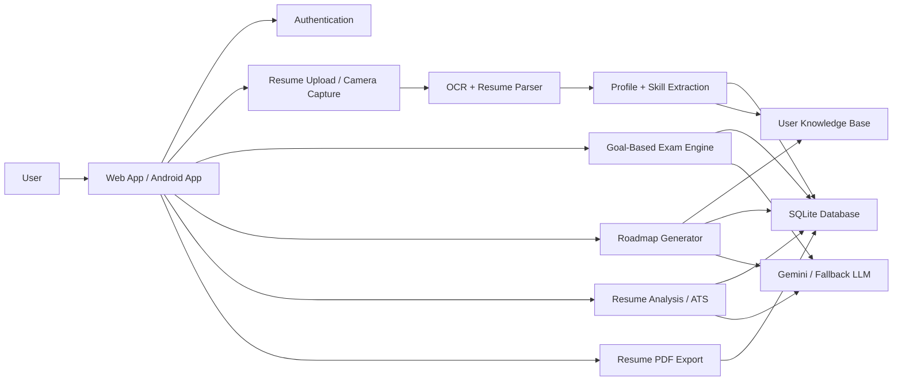

# SkillBridge Simplified Architecture Diagram

## Read This Diagram Left To Right

1. The user interacts through the web app or Android app.
2. The user signs in and uploads a resume or captures a resume photo.
3. OCR and resume parsing extract structured user information.
4. That information is stored in the database and synchronized into the user knowledge base.
5. The exam engine evaluates the user's actual skill level.
6. The roadmap generator uses the exam result plus the user knowledge base to create a personalized roadmap.
7. The ATS module analyzes the resume and suggests improvements.
8. The PDF module exports resume content as a downloadable PDF.
