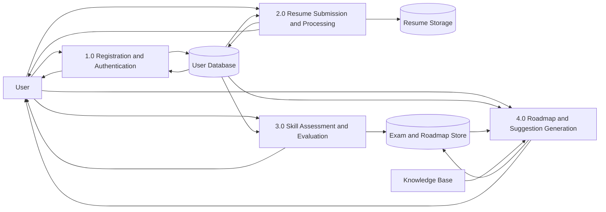

# SkillBridge DFD Level 1

```mermaid
flowchart LR
    U[User]
    P1[1.0 Registration and Authentication]
    P2[2.0 Resume Submission and Processing]
    P3[3.0 Skill Assessment and Evaluation]
    P4[4.0 Roadmap and Suggestion Generation]
    D1[(User Database)]
    D2[(Resume Storage)]
    D3[(Exam and Roadmap Store)]
    KB[Knowledge Base]

    U --> P1
    P1 --> D1
    D1 --> P1
    P1 --> U

    U --> P2
    P2 --> D2
    P2 --> D1
    D1 --> P2
    P2 --> U

    U --> P3
    P3 --> D3
    D1 --> P3
    P3 --> U

    U --> P4
    D1 --> P4
    D3 --> P4
    KB --> P4
    P4 --> D3
    P4 --> U
```
