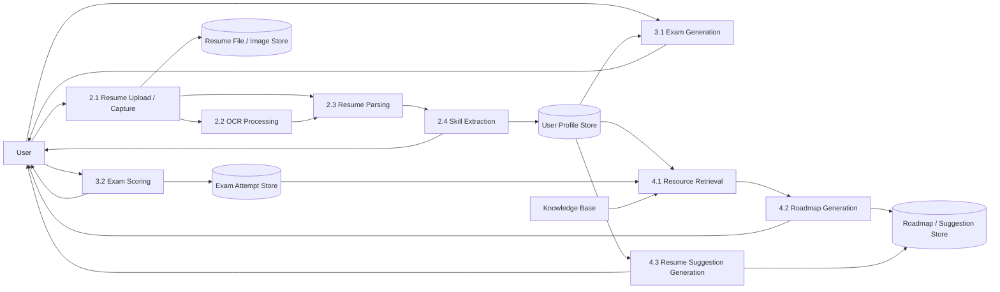

# SkillBridge DFD Level 2

```mermaid
flowchart LR
    U[User]
    P21[2.1 Resume Upload / Capture]
    P22[2.2 OCR Processing]
    P23[2.3 Resume Parsing]
    P24[2.4 Skill Extraction]
    P31[3.1 Exam Generation]
    P32[3.2 Exam Scoring]
    P41[4.1 Resource Retrieval]
    P42[4.2 Roadmap Generation]
    P43[4.3 Resume Suggestion Generation]

    D1[(User Profile Store)]
    D2[(Resume File / Image Store)]
    D3[(Exam Attempt Store)]
    D4[(Roadmap / Suggestion Store)]
    KB[Knowledge Base]

    U --> P21
    P21 --> D2
    P21 --> P22
    P21 --> P23
    P22 --> P23
    P23 --> P24
    P24 --> D1
    P24 --> U

    U --> P31
    D1 --> P31
    P31 --> U
    U --> P32
    P32 --> D3
    P32 --> U

    D1 --> P41
    D3 --> P41
    KB --> P41
    P41 --> P42
    D1 --> P43
    P42 --> D4
    P42 --> U
    P43 --> D4
    P43 --> U
```
