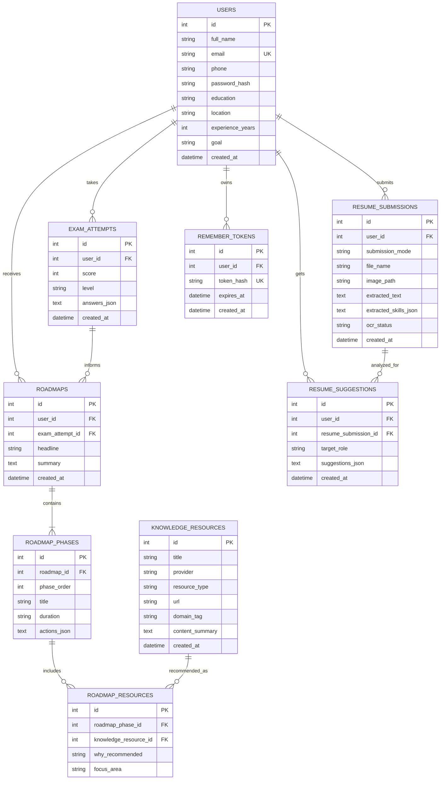

# SkillBridge ER Diagram

This ER diagram represents the revised SkillBridge data model.

- `users`, `exam_attempts`, `roadmaps`, and `remember_tokens` already exist in the current implementation.
- `resume_submissions`, `resume_suggestions`, `roadmap_phases`, `knowledge_resources`, and `roadmap_resources` are planned entities for the next version with React, mobile resume capture, OCR, and RAG support.

## Notes

- `submission_mode` in `RESUME_SUBMISSIONS` can be values such as `upload` or `camera_capture`.
- `ocr_status` helps track whether the image-based resume text extraction succeeded.
- `ROADMAPS` links to `EXAM_ATTEMPTS` so roadmap generation can be tied to the assessment result used.
- `ROADMAP_PHASES` and `ROADMAP_RESOURCES` make the RAG-based roadmap easier to model relationally than storing all phases as one JSON field.
- In the current codebase, some of this information is still stored in JSON fields inside `users` and `roadmaps`; this ER diagram reflects the cleaner revised design for the next version.
