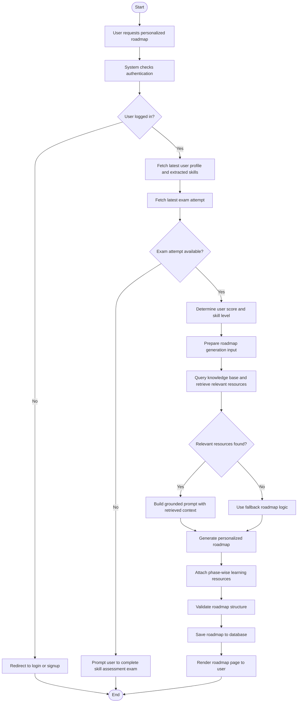

# SkillBridge Personalized Roadmap Generation Activity Diagram

```mermaid
flowchart TD
    A([Start]) --> B[User requests personalized roadmap]
    B --> C[System checks authentication]
    C --> D{User logged in?}
    D -- No --> E[Redirect to login or signup]
    E --> Z([End])
    D -- Yes --> F[Fetch latest user profile and extracted skills]
    F --> G[Fetch latest exam attempt]
    G --> H{Exam attempt available?}
    H -- No --> I[Prompt user to complete skill assessment exam]
    I --> Z
    H -- Yes --> J[Determine user score and skill level]
    J --> K[Prepare roadmap generation input]
    K --> L[Query knowledge base and retrieve relevant resources]
    L --> M{Relevant resources found?}
    M -- No --> N[Use fallback roadmap logic]
    M -- Yes --> O[Build grounded prompt with retrieved context]
    O --> P[Generate personalized roadmap]
    N --> P
    P --> Q[Attach phase-wise learning resources]
    Q --> R[Validate roadmap structure]
    R --> S[Save roadmap to database]
    S --> T[Render roadmap page to user]
    T --> Z
```
